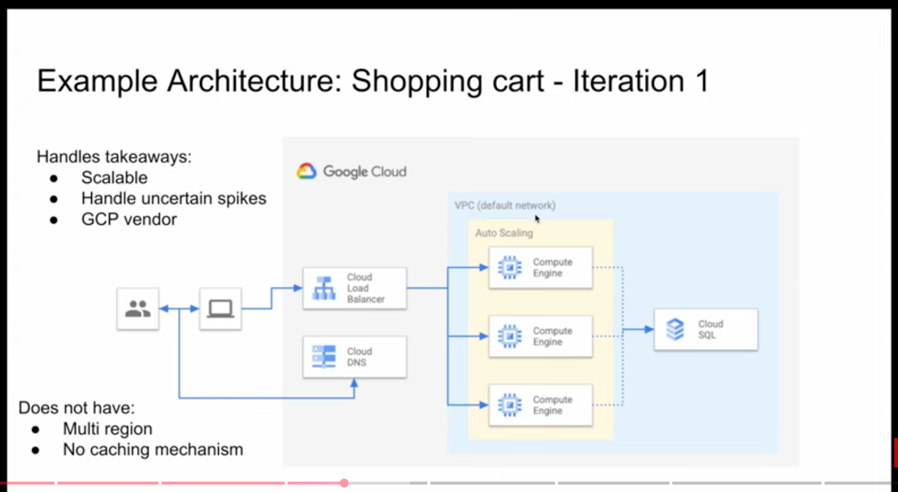
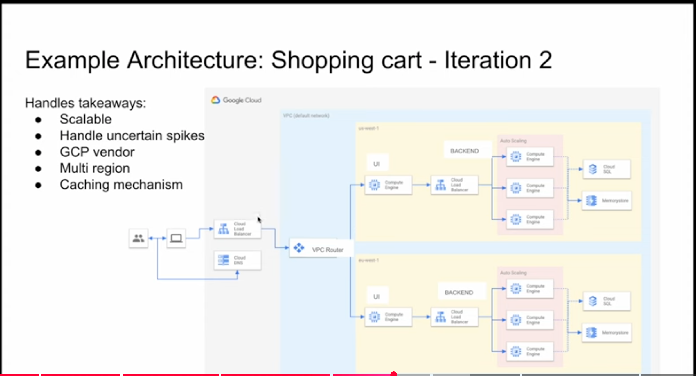
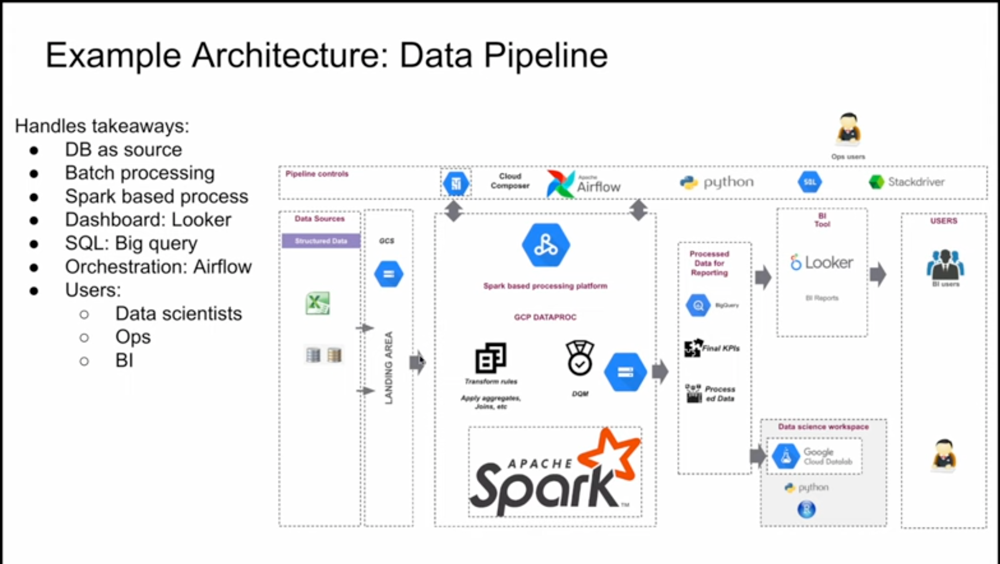

#### General System design
### shopping cart
#### Ask these questions to the interviewer before designing the actual solution

- Q1. Active User Count - Scalable Solution
- Q2. Unexpected loads -  Handle uncertain traffic (Scale up and Scale down)
- Q3. Stateless vs Stateful - Stateful (eg: We don't want shopping cart to lose data when refreshed)
- Q4. Global vs Regional - Multi-Regional
- Q5. Cloud Vendor - Any

****Start designing now****
Load balancer handles distribution of load on EC2(Compute Engine) machines under ASG

### Iteration 2

####  *****Data Engineer System Design***** ####

Ask these questions

- Q1. Data Source? MySQL Cloud DB
- Q2 Frequency of pipeline - Batch, Monthly
- Q3 Data Size - 450 GB/Monthly
- Q4 Migration vs New - (On premises to Cloud or Optimization)
- Q5 End Users - Business Analyst, Data Scientist, Operational User

